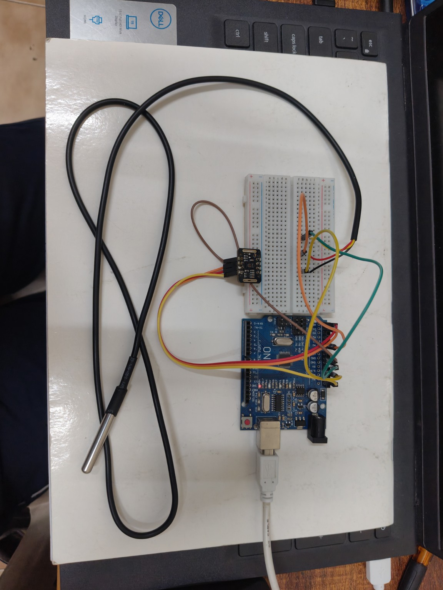

# Health Status Classification using Embedded Systems and Machine Learning 

## Overview

This project presents a machine learning-based healthcare monitoring system that predicts a person's health status using physiological parameters collected from sensors. It combines **Machine Learning**, **Embedded Systems**, and **Real-time Health Monitoring** to classify an individual's condition into predefined health categories.

The project demonstrates the complete workflow from dataset preparation and model training to deployment with Arduino-based hardware for live predictions.

---

## Features

- Real-time physiological data monitoring
- Health status classification using Machine Learning
- Comparison of multiple classification algorithms
- Live sensor integration with Arduino
- Embedded hardware implementation
- End-to-end healthcare prediction pipeline

---

## Objective

The objective of this project is to classify a person's health condition into one of the following categories:

- Normal
- Critical
- Emergency

using physiological sensor readings and machine learning models.

---

## Input Parameters

The classification model uses the following physiological parameters:

- Body Temperature
- Blood Oxygen Level (SpO₂)
- Pulse Rate (Heart Rate)

---

## Dataset

- **Source:** Kaggle Healthcare Dataset
- **Dataset Size:** 5000+ samples

The dataset was preprocessed and used for training and evaluating multiple machine learning classification models.

---

## Machine Learning Models

The following algorithms were implemented and compared:

- Logistic Regression
- K-Nearest Neighbors (KNN)
- Support Vector Machine (SVM)
- Decision Tree Classifier
- Random Forest Classifier

---

## Model Evaluation

The models were evaluated based on:

- Classification Accuracy
- Prediction Performance
- Decision Boundaries
- Generalization Ability
- Robustness
- Overfitting Analysis

---

## Best Performing Model

Among all the implemented algorithms,

**Random Forest Classifier** achieved the highest overall prediction performance and was selected for deployment.

---

## Hardware Used

### Controller

- Arduino Uno

### Sensors

- DS18B20 Waterproof Temperature Sensor
- MAX30102 Heart Sensor

The Arduino collects real-time sensor readings, which are used for health status prediction.

---

## Project Workflow

```text
Healthcare Dataset
        ↓
Data Preprocessing
        ↓
Feature Engineering
        ↓
Model Training
        ↓
Model Comparison
        ↓
Best Model Selection
(Random Forest)
        ↓
Arduino Sensor Interface
        ↓
Real-Time Sensor Data
        ↓
Health Status Prediction
```

---

## Technologies Used

### Programming Languages

- Python
- Arduino C/C++

### Machine Learning

- Scikit-learn
- Logistic Regression
- KNN
- SVM
- Decision Tree
- Random Forest

### Hardware

- Arduino Uno
- DS18B20 Temperature Sensor
- MAX30102 Heart Sensor

---

### Hardware Setup



The Arduino interfaces with the DS18B20 and MAX30102 sensors to collect live body temperature, heart rate, and blood oxygen (SpO₂) data. These physiological parameters are processed and used for real-time health status prediction.

---

## Learning Outcomes

This project provided practical experience in:

### Machine Learning

- Supervised Classification
- Logistic Regression
- K-Nearest Neighbors
- Support Vector Machines
- Decision Trees
- Random Forest
- Ensemble Learning
- Model Evaluation
- Overfitting vs Generalization

### Data Science

- Data Preprocessing
- Feature Selection
- Dataset Handling
- Model Comparison

### Embedded Systems

- Arduino Programming
- Sensor Interfacing
- Real-Time Data Acquisition
- Hardware Integration

### AI + Embedded Systems

- Integrating Machine Learning with Embedded Hardware
- Real-Time Health Monitoring
- Edge-based Intelligent Prediction Systems

---

## Future Improvements

- Integrate additional biomedical sensors (ECG, Blood Pressure, etc.)
- Cloud-based health monitoring
- IoT-enabled remote patient monitoring

---

## Repository Structure

```text
health-status-classification/

├── Dataset/
├── Images/
├── README.md
```

---

## Final Outcome

This project successfully demonstrates a complete healthcare monitoring pipeline by combining **Machine Learning** and **Embedded Systems**. It evaluates multiple classification algorithms, identifies **Random Forest** as the best-performing model, and integrates live sensor data with Arduino hardware to perform real-time health status prediction.

The project showcases practical skills in **Artificial Intelligence, Data Science, Embedded Systems, and Healthcare IoT**, making it a comprehensive end-to-end machine learning application.